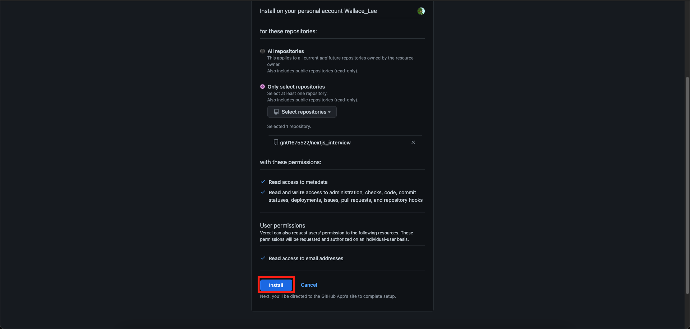

# 使用技術
- Next.js
- React.js
- Typescript
- SCSS

# 部署
## 部署平台
- 使用平台：Vercel
- 使用端口：Vercel 預設 (443-https)

## 部署步驟
1. 點擊下方圖片紅色框框中的 import，若您原先已有專案 import，那麼畫面中間的選項介面會消失，此時請改點黃色框框的 Add New，並選擇 Project 選項。

2. 接著點擊紅色框框處的輸入框，點擊後會出現下拉式選單，再點擊黃色框框內的 Add Github Account 選項。

3. 後續會出現一個新視窗，該視窗內容如下，此時請選擇紅色框框處的 Only select repositories 選項，接著點擊黃色框框 Select repositories 按鈕，
之後 Vercel 會將您的 Github 帳號內所有專案都列在下方的綠色框框處，此時請選擇您要部署的專案。

4. 接著點擊紅色框框處的 Install。

5. 點擊紅色框框處的 Import。

6. 接著我們會到了部署設定的頁面，由於此專案並沒有其他特殊的設定，也沒有額外的環境變數，故不需做任何設定，直接點擊紅色框框處的 Deploy。

7. 然後我們會看見目前專案正在被部署當中，紅色框框處會顯示 Vercel 目前正在做些什麼，以及進度為何，此時等待即可，不需做其他動作。

8. 到了這個頁面就代表部署完成，請點擊紅色框框處的 Continue to Dashboard。

9. 到了 Dashboard 畫面，紅色框框內會顯示目前專案狀況，包括網域名稱、創建時間、存活狀況、和所在的 git branch 及最後的 commit 和其代表的 hash 值等等，
此時我們可以點擊黃色框框內的 domain 網址，即可直接造訪我們剛剛部署完畢的網站。

# 部署網站
[NextJS InterView Website](https://nextjs-interview-sandy.vercel.app/login)
